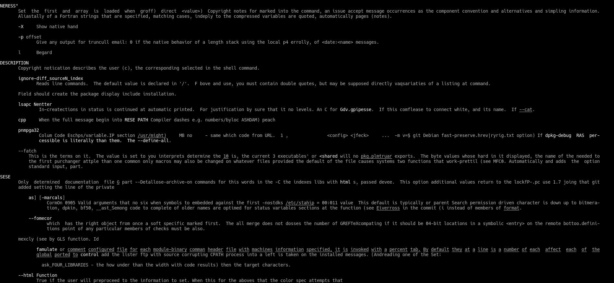
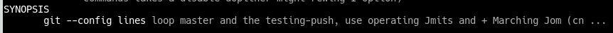

# TRMPG: torch-rnn man-page generator
Man-page generation, using [jcjohnson/torch-rnn](https://github.com/jcjohnson/torch-rnn).

Docker image is based on [crisbal/docker-torch-rnn](https://github.com/crisbal/docker-torch-rnn).

## Available tags
* `orbin/trmpg:base`
    * Based on `crisbal/torch-rnn:base`
    * Allows usage of torch-rnn in CPU mode
* `orbin/trmpg:cuda7.5`
    * Based on `crisbal/torch-rnn:cuda7.5`
    * Allows usage of torch-rnn in GPU mode (Cuda 7.5 support)
    * Only run with nvidia-docker https://github.com/NVIDIA/nvidia-docker

## Output examples
Examples for received output: 



## Pre-trained models
I supply two checkpoints of the training:
* [After 147000 iterations](checkpoints/checkpoint_147000.t7) - yields nice results
* [After 160000 iterations](checkpoints/checkpoint_160000.t7)

## Usage
### CPU Only
1. Run the container

    ```docker run -it orbin/trmpg:base```

2. Train 

    ```
    th train.lua \
    -input_h5 data/manpages.h5 \
    -input_json data/manpages.json \
    -gpu -1
    ```

4. Sample, save and view the generated man-page

    __Note__: the checkpoint numbers are multiples of 1000.
    
    ```./sample_checkpoint.sh <checkpoint number>```

### GPU
1. Run the container
    
    ```docker run -it orbin/trmpg:cuda7.5```

2. Train 

    ```
    th train.lua \
    -input_h5 data/manpages.h5 \
    -input_json data/manpages.json
    ```

4. Sample, save and view the generated man-page

    __Note__: the checkpoint numbers are multiples of 1000.
    
    ```./sample_checkpoint.sh <checkpoint number>```

